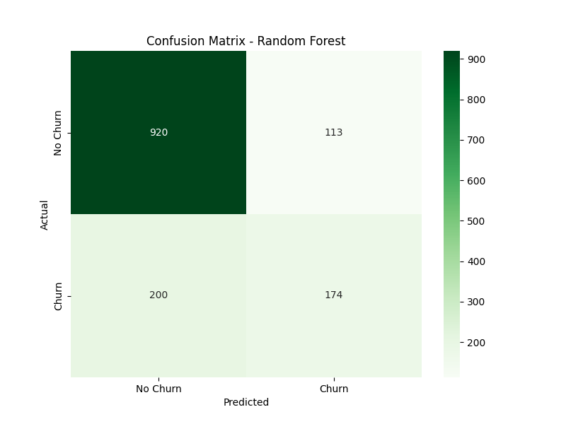
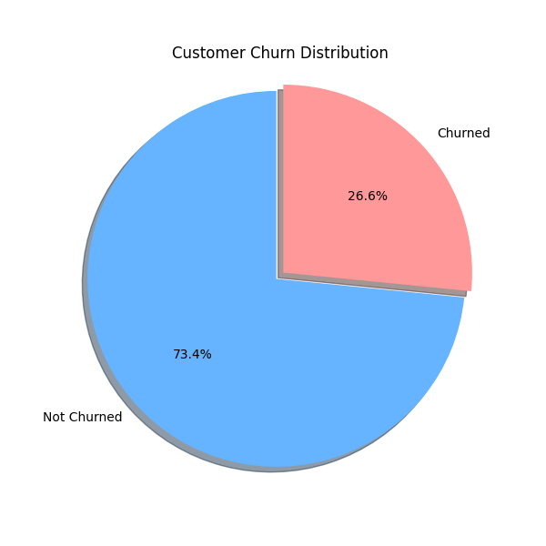

Customer Churn Prediction

This project predicts whether a telecom customer will churn (leave the company) based on structured data such as tenure, contract type, and payment method.

Objective

The goal is to use supervised machine learning to identify patterns in customer behavior and predict churn before it happens.

Dataset

- **Source**: [Kaggle - Telco Customer Churn](https://www.kaggle.com/datasets/blastchar/telco-customer-churn)
- Format: CSV
- Rows: ~7000
- Target column: `Churn` (Yes/No)

Workflow

1. **Data Cleaning**: Converted `TotalCharges` to numeric, dropped empty rows
2. **Encoding**: Transformed categorical variables to numeric (e.g., OneHotEncoding / LabelEncoding)
3. **Model Training**: Used `RandomForestClassifier`, tested with other classifiers
4. **Evaluation**: Accuracy, classification report, and confusion matrix
5. **Visualization**: Churn distribution, confusion matrix

Example Output

**Accuracy: ~79%**

### Confusion Matrix

### Churn Distribution (Pie Chart)

Technologies Used

- Python
- pandas, numpy
- scikit-learn
- seaborn, matplotlib

How to Run

1. Clone the repo
2. Install dependencies:
3. Open `notebook/churn_prediction.ipynb`

Author

Mathias Olsen  
[GitHub](https://github.com/MathiasOlsen-git)
